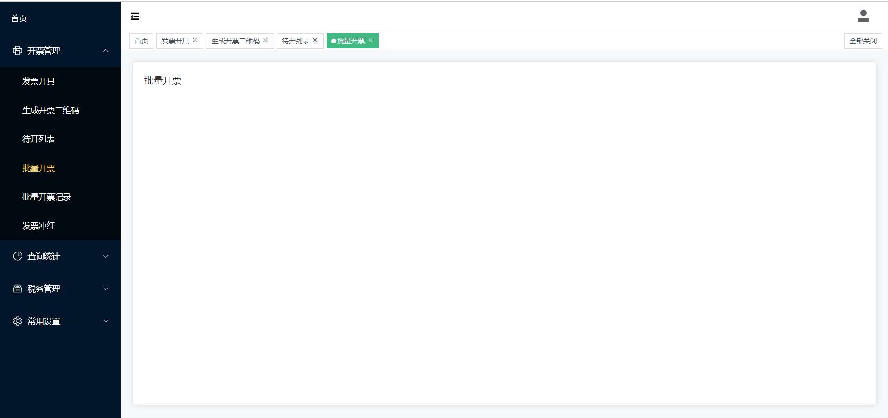

## 简介

一个简洁的，可用于快速搭建的 Vue3 + Vite4 + Pinia + ...后台模板框架，适用于个性化二次开发。

测试账号: 随便输入

## 特性

- **Vue3**：采用 Vue3 + script setup 最新的 Vue3 组合式 API
- **Element Plus**：Element UI 的 Vue3 版本
- **Pinia**: 传说中的 Vuex5
- **Vite**：真的很快
- **Vue Router**：路由路由
- **Axios**：发送网络请求（已封装好）

## 项目预览图



## 安装使用

- 获取项目代码

```bash
git clone https://github.com/wf-bao/admin-template.git
```

- 安装依赖

```bash

npm install

```

- 运行

```bash
npm run dev
```

- 打包

```bash
npm run build
```